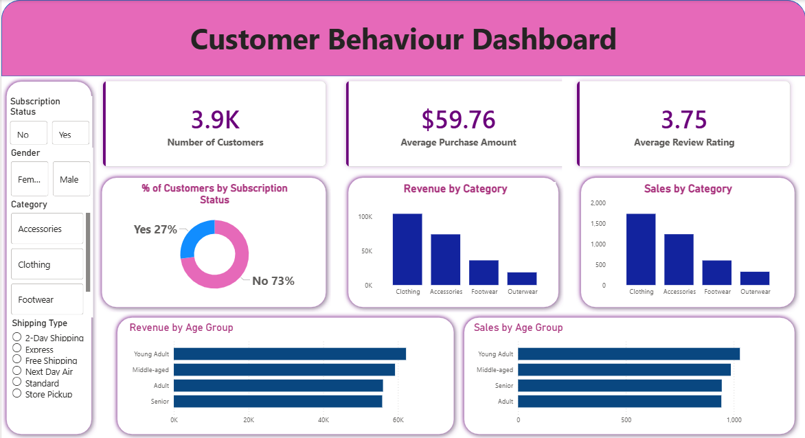

# customer_behaviour_analyze

## 📌 Project Overview

This project focuses on analyzing customer behaviour to understand purchasing patterns, preferences, and trends. The analysis helps identify which product categories and items are most popular, as well as differences in shopping behaviour between male and female customers.

---

## 🎯 Objective

* To analyze customer purchasing behaviour
* To identify top-performing product categories and items
* To understand customer preferences based on gender and age
* To generate insights for better business decision-making

---

## 🛠️ Tools & Technologies Used

* **Python (Jupyter Notebook)**

  * Pandas (Data Cleaning & Analysis)
* **SQL**

  * Data querying and aggregation
* **Power BI**

  * Interactive dashboard creation

---

## 📂 Dataset Information

* Dataset contains customer shopping data including:

  * Customer details
  * Product categories
  * Purchase amount
  * Review ratings
  * Subscription status
  * Shipping type

---

## 🔍 Steps Performed

1. **Data Cleaning**

   * Handled missing values
   * Converted data types
   * Removed inconsistencies

2. **Data Analysis (Python & SQL)**

   * Analyzed customer purchase trends
   * Identified top categories and products
   * Compared behaviour across gender and age groups

3. **Data Visualization**

   * Built an interactive dashboard using Power BI

---

## 📈 Key Insights

* Clothing category generates the highest revenue and sales
* Majority of customers do not have a subscription (~73%)
* Female and male customers show different purchasing patterns
* Young adults contribute the highest sales
* Average purchase amount is around $59.76
* Customer rating is strong with an average of 3.75

---

## 📊 Dashboard Features

* KPI Cards:

  * Total Customers
  * Average Purchase Amount
  * Average Review Rating

* Visualizations:

  * Revenue by Category
  * Sales by Category
  * Customer Distribution by Subscription Status
  * Sales & Revenue by Age Group

---

## 🖼️ Dashboard Preview

---

## 📂 Project Files

* `notebook.ipynb` → Python analysis
* `analysis_queries.sql` → SQL queries
* `dashboard.pbix` → Power BI dashboard
* `dashboard.png` → Dashboard screenshot

---

## 🚀 Conclusion

This project provides meaningful insights into customer behaviour, helping businesses understand customer preferences, improve product strategy, and enhance decision-making through data-driven analysis.

---

## 🔗 Future Improvements

* Add predictive analysis using machine learning
* Include customer segmentation
* Automate dashboard updates

---
